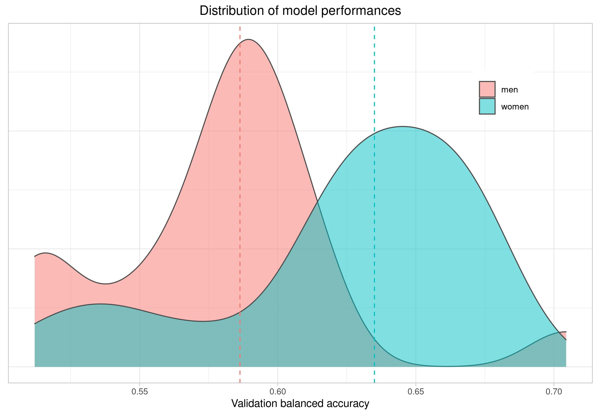

# Pre-Registation: Facing Election
This is the pre-registered code repository for our paper "*Facing Elections -- 
-- Predicting electoral success from facial images of political candidates*" (working title).
The repo serves as the pre-registration that describes our preprocessing and
modelling choices used in our prediction. 

We investigate  whether it is possible to predict the electoral success of political candidates using only images
of their faces. Our paper focuses on a low-salience and low-polarized setting such as the 2017 and 2021
municipal elections in Denmark. We fine-tune a pre-trained Convolutional Neural Network (CNN) architecture `VGG16` and test 
whether we can train the model on facial images of candidates from the 2017 election to predict which candidates are 
elected in 2021. 

The Danish 2021 municipal elections take place on November 16, 2021. The polling stations close at
8pm meaning that we have no information about which candidates that are elected in 2021 before that. 
Thus, we upload all our files to the repo before 8pm 2021. This can easily be verified due to Git's
version control. 

Unfortunately, GitHub does not allow for large data files. Therefore, we can not upload
Our 220.6 MB CNNs. Instead, we have both created a pre-registered project at OSF and
created a Dropbox link. We leave both of them unchanged after 8pm November 16 2021.
This can easily be verified looking at the timestamps and version history for 
each file. Note that `CNN_men.hdf5` and `CNN_women.hdf5` is the main models. 

OSF link: https://osf.io/bdwf6/

Dropbox link: https://www.dropbox.com/sh/ti4k4k38b09y1cp/AAA9AcJFfDE4P9CTuPG24xrZa?dl=0

Link to CNN for male candidates: https://www.dropbox.com/sh/qyxrrafipdsn7pk/AABFH6Cec10NUMPLl5_nFmaza?dl=0

Link to CNN for female candidates: https://www.dropbox.com/sh/nr599138edb6dtc/AAB7aI4n-0sY0tM7VX5JpO77a?dl=0

## Repository content
The repository contains the following folders and files:
* `utils/preprocessing` (folder with utils)
* `utils/analysis` (folder with utils)
* `scripts/validation` (folder with scripts used to validate our CNNs)
* `scripts/hypothesis` (folder with scripts used to test pur hypotheses)
* `plots` (folder with plots)
* `model` (folder with model performance)
* `R` (folder with R scripts)
* `param.py` (script with fixed parameters and paths)
* `00_image-cleaning.py` (preprocessing of images)
* `01_gridsearch.py` (grid search)
* `02a_2017_models_men.py` (training of model for men)
* `02b_2017_models_women.py` (training of model for women)
* `2017-data.csv` (,-separated data with information about 2017 candidates)
* `MAIN-pre-reg-facing-elections.pdf` (pre-registered report)
* `SI-pre-reg-facing-elections.pdf` (SI for pre-registered report)
* `requirements.txt` (libraries used in the scripts) 


The two utils folders, `utils/preprocessing` and `utils/analysis`, contains functions used to preprocess and implement the
training and analysis of our CNN approach. The functions are used in the main scripts:
* `00_image-cleaning.py` (preprocessing)
* `01_gridsearch.py` (grid search)
* `02a_2017_models_men.py` (training of model for men)
* `02b_2017_models_women.py` (training of model for women)

The `00_image-cleaning.py` script conducts all of our image preprocessing. Please note 
that `00_image-cleaning.py` requires a file called `shape_predictor_68_face_landmarks.dat`. This is not uploaded on
GitHub due to file size issues, but can be obtained freely at [`Dlib`](http://dlib.net/files/shape_predictor_68_face_landmarks.dat.bz2]).    

The `01_gridsearch.py` script conducts a grid search over a space of hyperparameters to
select the optimal model. 

Finally, after conducting the grid search, we use the hyperparameters to select our final models
in `02a_2017_models_men.py` and `02b_2017_models_women.py`. See links to models stored
on Dropbox in top of the *README.md*.

The `scripts` folder contains unfinished `.py`-scripts that we will use to test some
of our hypotheses in `MAIN-pre-reg-facing-elections.pdf` and to validate our CNNs. 
The scripts are taken from another project we have been working on and is therefore not adapted to this
application. We have not added a script for the facial expression hypothesis yet (H2), 
but we intend to use Azure's API and validate the measures with 
[`Py-Feat`](https://py-feat.org/). As the scripts are unfinished, 
there will be differences in the final scripts we use, but we intend to stick with 
the general approach put forward in the scripts. 

The `model` folder contains two `.csv` files with a dataframe containing information
about the model performance (e.g. training and validation accuracy). 
The `R` folder contains code implemented in R. This includes, among others, analysis of
the grid search to produce plots. The `plots` folder contains plots used in this *README.md*. 

The `data-2017.csv` data set contains information about the candidates we used to train our models. Thus, it does not include information
about candidates for whom we have no images , candidates that we removed due to bad image quality,
or candidates that were removed since we could not or remove the background of their image. 

Lastly, our pre-registered repository contains a report `MAIN-pre-reg-facing-elections.pdf` that describes
our approach in more details. The report is unfinished work, but the important aspect is the hypotheses
we put forward and how we are going to test them. We also include a supplementary information report `SI-pre-reg-facing-elections.pdf`
that primarily describes our two alternative approaches to model selection. 

## Pre-registration of CNNs
We use CNNs to analyze whether facial images predict the electoral success of candidates. 
Since we are interested in how facial traits and facial expressions influence the electoral prospects of political candidates,
we trained two separate CNNs: one for male candidates and one for female candidates. Males and females have biological
differences in their facial structure, which makes it harder for the CNN to learn the relevant features. To see this clearly,
imagine that the jaw is influential in predicting the electoral prospects for females, while the nose is 
influential for men. In this case, the CNN will try to learn both feature areas simultaneously which clearly is suboptimal
from a learning perspective. 

We use transfer learning shown to achieve state-of-the-art performance in CNN tasks. We employ
the widely used `VGG16` network which has six convolutional kernels. We import the pre-trained network from 
``` python
from tensorflow.keras.applications import VGG16
```

We use a 0.7/0.3 training-validation split and train the model for 50 epochs with early stopping with 15 patience steps.
Thus, if the validation accuracy has not improved for 10 epochs, the model fit terminates and
returns the weights of the best epoch.

### Grid Search
To select the optimal set of hyperparameters, we conducted grid search over the space, iterating the process five times:

giving a total of 54 model combinations for female candidates and 36 for male candidates. We did not search over
1e-04 for men as we discovered that the model ended up predicting the majority class each time. 

We obtained the following results:

**Men**:


**Women** (we only show the top 36 results to match the male plot):


The code used to create the plots can be found in `R/gridsearch-analysis.R`. 

We investigated both the mean balanced validation accuracy and the standard deviation. While 5 iterations
are not enough to say something about the distribution of the model performance, it gives an indication. 
After analyzing the plots, we decided to go with the following specifications:

|         | Men      | Women  |
| ------------- |:-------------:| :-----:|
|  transfer |  fine-tune |  fine-tune   |
|  learning rate   | 1e-06  | 1e-05 |
| batch size|  16 | 16 |
|  dropout|  0.5 |  0.5   |

Thus, we use fine-tune the `VGG16` pre-trained network for both male and female candidates using
a batch size of 16 and a dropout probability of 50% for both models. We only vary the learning rate
using 1e-06 for men and 1e-05 for women. This is very low learning rates compared to typical 
applications, but if used a higher rate (e.g. 0.001) our models predicted the majority class
each time. 


### Implementation of `VGG16`
For both male and female candidates, we implement our full model as (but with differing 
learning rate, *lr*): 
``` python
base_model = VGG16(weights='imagenet',
                   include_top=False,
                   input_shape=(224, 224, 3))
base_model.trainable = True
x = base_model.output
x = layers.Flatten()(x)
x = layers.Dropout(.5)(x)
x = layers.Dense(512, activation='relu')(x)
predictions = layers.Dense(1, activation='sigmoid')(x)

model = models.Model(inputs=base_model.input, outputs=predictions)

model.compile(loss='binary_crossentropy',
                  optimizer=optimizers.RMSprop(learning_rate=lr),
                  metrics=['acc'])

```
Note that the `base_model.trainable = True` means that we are able to fine-tune the network.
If `False`, the network is used as a feature extractor instead. 

As shown in the code, we do not include the fully connected layers of the `VGG16` 
network (`include_top=False`), 
but instead adds a fully connected layer ourselves. First we flatten the outputs 
from the fine-tuning. Second we add a dropout layer using the dropout probability 
as returned from the gridsearch. Third, we add a dense layer with 512 weights and 
then wrap up the network with an output layer with a single node activated with 
the sigmoid function.

### Class Imbalance
Since our target (electoral success) is heavily imbalanced (we have a lot more non-elected than elected candidates), we apply
oversampling with a ratio of 0.75. This means that we oversample elected candidates until they constitute 75% 
of the total number of samples. We only do so for the training data. We use the `imblearn` library and the code:
``` python
from imblearn.over_sampling import RandomOverSampler

oversampler = RandomOverSampler(sampling_strategy=.75)
X_train = np.reshape(np.array(X_train), (len(X_train), 1))
X_train, y_train = oversampler.fit_resample(X_train, y_train)
```

We use the same ratio for both male and female candidates despite a small difference in
prior class probabilities. Our overall distribution in the 2017 data is:

|         | Unelected      | Elected  |
| ------------- |:-------------:| :-----:|
|  **Women** |  893 (61.3%) |  563 (38.7%)  |
|  **Men**   | 2133 (65.8%) | 1110 (34.2%)|

The prior class distributions are computed in `R/prior_class_prob.R`. 


### Image Augmentation
To reduce the impact of image-specific features and to effectively increase the number of training samples
at our disposal, we use image augmentation. We implement it in the following way:
``` python
from tensorflow.keras.preprocessing import image

train_datagen = image.ImageDataGenerator(
    rescale=1. / 255,
    rotation_range=1,
    width_shift_range=0.1,
    height_shift_range=0.1,
    shear_range=0.1,
    zoom_range=0.1,
    horizontal_flip=False,
    fill_mode='nearest')

train_generator = train_datagen.flow_from_directory(
    path + 'train',
    target_size=target_size,
    batch_size=batch_size,
    class_mode='binary',
    shuffle=True)

```
where the `batch size` is defined as returned from the grid search. In this case we use
`batch_size=16` for both models. 

### Model Selection
We use a "soft selection" approach to model selection as we discovered instability in our training. 
For instance, as we use early stopping (with 10 patience steps), our model sometimes terminated after the
11th epoch if the validation accuracy did not improve after epoch 1. When this situation occurred, we
saw a substantial drop in generalization and achieved only around 50% balanced validation accuracy.

Thus, instead of training a single model where we risk using the weights from epoch 1, we train
20 models to define a distribution over the model performance. This is akin to Bayesian inference, but
rather than computing a posterior, we use a simple selection rule: *We select the model at the 50th percentile*,
that is the median of the distribution. Since we iterate over the model 20 times, 
this corresponds to the 10th best model. Although we risk introducing overfitting
into our learning, we suspect that selecting the median model should balance the
under- vs. overfitting trade-off we face. 

As an alternative to the "soft selection" approach, we report the results using three other model selections:
1. Single best model: We select the best model of the 20 iterations
3. PAC-Bayesian: We use a Bayesian approach where we compute the posterior probability of each
of the 20 iterations and then use them as an ensemble where we weight each of the model's predictions by
by the posterior probability. We compute the posterior probability by minimizing a PAC-Bayes-lambda bound. 
See `SI-pre-reg-facing-elections.pdf` for further details and references on the bound.  

## Training and Validation: 2017 candidates
Here, we report the model performance on the 2017 images. we report the balanced
accuracy as this takes the imbalance into account. We start by plotting the model performance
for both male and females over the 20 iterations: 



The distributions clearly show that we have fat tails around 50% for both male and 
female candidates. This supports our notion that a "soft selection" procedure for model
selection are likely to achieve better generalization in a single application, although 
it does not matter in expectation (i.e. the expected value is the same whether we
use hard or soft selection). 

Below we show a table with different estimates of the generalization error across 
different models. Recall that we use the models at the 50th percentile (i.e. the median)
for both male and female candidates. We have marked their respective estimates of their
generalization error in **bold**. 
 
|         | Men      | Women  |
| ------------- |:-------------:| :-----:|
| *Training*|  |   |
| **0-1 loss (50th percentile)** | **0.383** | **0.314** |
| **Balanced accuracy (50th percentile)** | **59.83%** | **66.36%** |
| Balanced accuracy (1st percentile) | 53.12% | 51.44% |
| Balanced accuracy (100th percentile) | 68.78% | 73.25%|
| 0-1 loss (average) | 0.389 | 0.332 |
| Balanced accuracy (average) | 58.35% | 63.77% |
| *Validation*|  |   |
| **0-1 loss (50th percentile)** |**0.369** |**0.327** |
| **Balanced accuracy (50th percentile)** | **58.48%** | **63.27%** |
| Balanced accuracy (1st percentile)|  51.19% | 51.40%|
| Balanced accuracy (100th percentile)| 70.44%  |  68.26% |
| 0-1 loss (average) | 0.358 |  0.327 |
| Balanced accuracy (average) | 58.00%  | 62.45%|

We note that the validation balanced accuracy somewhat resembles the output for 
the grid search, in particular for men. For the CNN for men, our grid search returned an average of
59.84% (5 iterations) compared to 58.00% (20 iterations) in our model selection. 
For the CNN for women, the difference is a little larger. Our grid search returned an 
average of 71.41% (5 iterations) compared to 62.45% (20 iterations) in our model selection. 

We briefly note that our initial estimates supports H1 and H3 in `MAIN-pre-reg-facing-elections.pdf`.
We have not tested the other hypotheses yet. 

The code used to produce the balanced training and validation accuracies (and 0-1 loss)
can be found in `R/model-performance.R` while the data used in the code is found in the 
`model` folder (`model/model-performance_men.csv` and `model/model-performance_women.csv` respectively).
You also find the code and data used to produce the density plot in the same script and data files. 

## Requirements
The code is implemented using `Python version 3.8`. A full list of requirements with specific package versions
are found in `requirements.txt`. 

## GPU (Optional)
We run the code in PyCharm. If your system has a GPU available you manually have to update the environmental variables in PyCharm. Go to `settings-Build, Execution, Deployment - Console - Python Console` and add a new variable. On Ubuntu 20.04 set `LD_LIBRARY_PATH=/usr/lib/cuda/include:/usr/lib/cuda/lib64`.

This should be familiar if you have correctly installed CUDA and cudnn for GPU-support using Tensorflow. 
